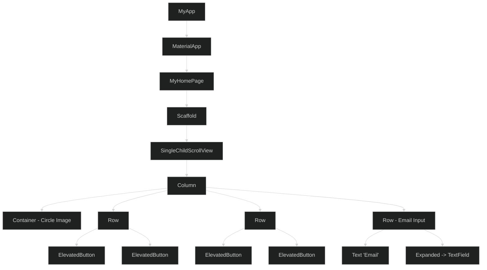
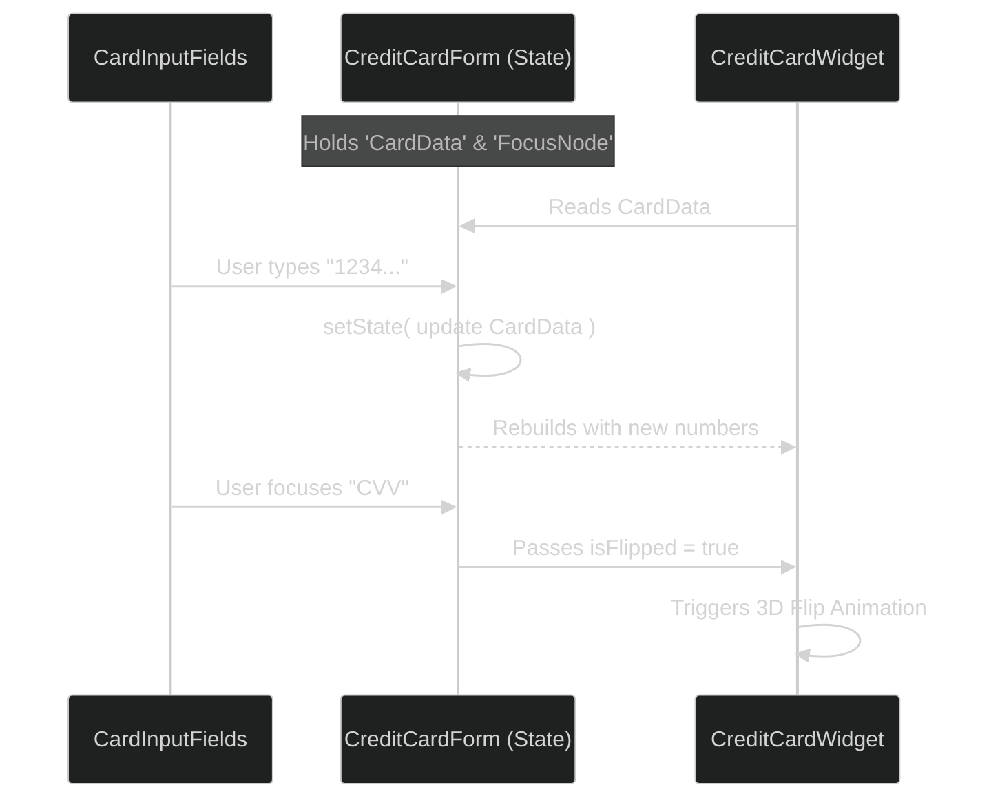
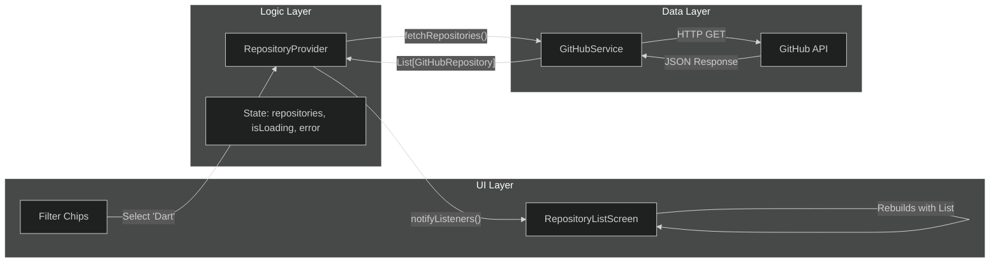

# TDDC73 Lab Presentation Notes

This document contains key talking points, structural diagrams, and deep-dive explanations for Labs 1-3. Use this to guide your presentation.

---

## Lab 1: UI Layout Comparison

**Goal:** Create the exact same simple UI using four different frameworks (Flutter, React Native, Kotlin+Compose, Kotlin+XML) to understand **Declarative vs. Imperative** paradigms.

### Structure: The Flutter Widget Tree
This diagram illustrates the declarative nature of the Flutter solution. Instead of defining XML and finding views, the UI is built as a tree of widgets.

---

## Lab 2: Interactive Credit Card Form

**Goal:** Build a highly interactive form with animations and state management, separating the visual representation from the input logic.

### Data Flow: Lifting State Up
This diagram shows how `CreditCardForm` acts as the "Source of Truth," managing state for both the visual card and the input fields.

---

## Lab 3: GitHub Trending App

**Goal:** Fetch data from an external API (GitHub) using asynchronous networking and the Provider pattern for architecture.

### Architecture: The Provider Pattern
This diagram illustrates the separation of concerns. The UI never touches the API directly; it goes through the Provider.

### Deep Dive & Talking Points

#### 1. Architecture: The Provider Pattern
*   **Why:** "I didn't want my UI code (the widgets) to be cluttered with HTTP requests. It makes the code hard to read and test."
*   **How:** "I created a `RepositoryProvider` class that extends `ChangeNotifier`. This class holds the list of repositories and the current loading state (`isLoading`). The UI simply 'subscribes' to this provider. When data arrives, I call `notifyListeners()`, which tells Flutter to rebuild the screens that are listening."

#### 2. Asynchronous Networking (`GitHubService.dart`)
*   **Concept:** "Fetching data takes time, so I used Dart's `Future` and `await` keywords. This allows the main thread to keep running (keeping the UI responsive) while the network request happens in the background."
*   **The API Call:** "I manually constructed the query string for GitHub's API. For example, if the user selects 'Dart' and 'This Week', I calculate the date for 7 days ago and build a query like `q=language:Dart created:>2023-11-18`."

#### 3. JSON Deserialization
*   **Process:** "The API gives me a raw JSON string. I used `json.decode` to turn it into a Map, and then I used a factory constructor `GitHubRepository.fromJson` to convert that Map into a type-safe Dart object. This ensures that if the API changes or sends bad data, I catch it early in the model layer, not in the UI."

#### 4. Filter Logic
*   **Detail:** "I implemented dynamic filtering. The `_getSinceDate` method calculates the date based on the user's choice (Today/Week/Month) using `DateTime.now().subtract(...)`. This decouples the UI's 'human-readable' options from the API's strict date requirements."
