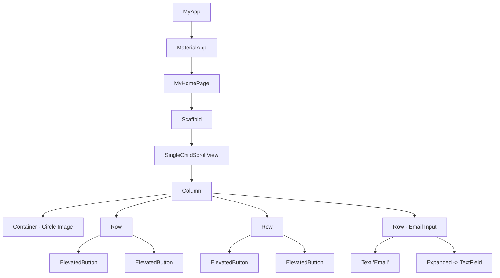
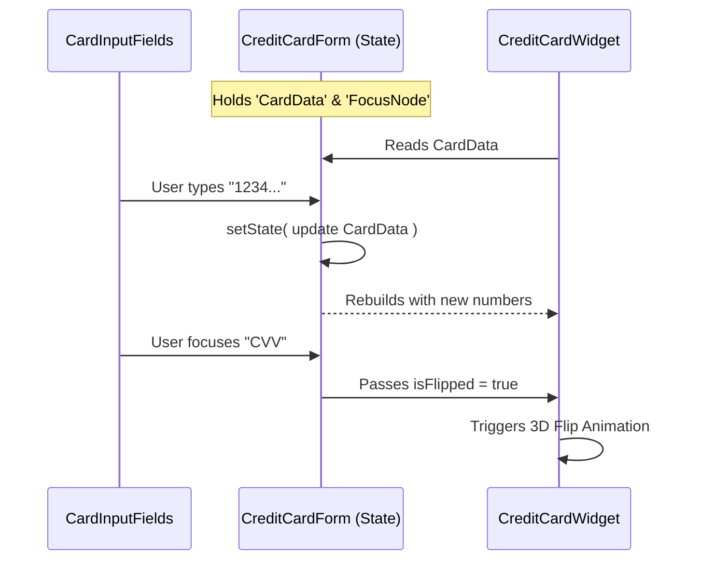

# TDDC73 Lab Presentation Notes

This document contains key talking points, structural diagrams, and deep-dive explanations for Labs 1-3. Use this to guide your presentation.

---

## Lab 1: UI Layout Comparison

**Goal:** Create the exact same simple UI using four different frameworks (Flutter, React Native, Kotlin+Compose, Kotlin+XML) to understand **Declarative vs. Imperative** paradigms.

### Structure: The Flutter Widget Tree
This diagram illustrates the declarative nature of the Flutter solution. Instead of defining XML and finding views, the UI is built as a tree of widgets.



### Deep Dive & Talking Points

"For Lab 1, I built the same interface—a profile-like screen with an image placeholder, grid buttons, and an input—using four different approaches. My goal was to understand the difference between **imperative** and **declarative** UI paradigms."

#### 1. The "Declarative" Shift (Flutter/Compose/React Native)
*   **Concept:** "In the old Android XML way, I had to define a layout file and then write separate Java/Kotlin code to 'find' those views (`findViewById`) and manually mutate them (e.g., `button.setText()`)."
*   **My Solution:** "In Flutter and React Native, the UI is a function of the state. I don't 'find' the text field; I declare it right there in the code. If I want to change it, I just rebuild the widget tree with new data."

#### 2. Layout Models: Flexbox vs. Row/Column
*   **React Native:** "I used `View` and `Flexbox` properties like `flexDirection: 'row'` and `justifyContent: 'space-between'`. This mimics web development (CSS)."
*   **Flutter:** "Flutter simplifies Flexbox into explicit widgets. Instead of setting a property, I wrap my buttons in a `Row` (for horizontal) or `Column` (for vertical). I used `MainAxisAlignment.center` to space them out, which is exactly like `justify-content: center` in CSS."

#### 3. Handling Mobile Constraints
*   **The Scroll Problem:** "One specific thing I added in Flutter was `SingleChildScrollView`. Without it, if I opened the keyboard to type in the email field, the screen size would shrink, and I'd get a yellow/black 'overflow' error. This widget makes the layout scrollable so it adapts to the keyboard."

---

## Lab 2: Interactive Credit Card Form

**Goal:** Build a highly interactive form with animations and state management, separating the visual representation from the input logic.

### Data Flow: Lifting State Up
This diagram shows how `CreditCardForm` acts as the "Source of Truth," managing state for both the visual card and the input fields.



### Deep Dive & Talking Points

"For Lab 2, I built a reactive credit card form. The core challenge here was managing state between two separate components: the visual card display and the input form."

#### 1. "Lifting State Up"
*   **Why:** "I have two main widgets: `CreditCardWidget` (the pretty card) and `CardInputFields` (the text boxes). They are siblings. The card needs to show what I type in the fields."
*   **How:** "I created a parent widget, `CreditCardForm`, that holds the `CardData` object. When I type in the input, it calls a callback function that updates the parent's state, which then passes the new data down to the `CreditCardWidget`. This ensures they are always in sync."

#### 2. The 3D Flip Animation (`CreditCardWidget.dart`)
*   **Concept:** "The card flip isn't just a simple image swap. I used an `AnimationController` and `Matrix4` transformations."
*   **Implementation:** "I set up a `Tween` that goes from 0 to 1. When the `isFlipped` boolean changes (triggered by focusing the CVV field), the controller runs forward or backward.
*   **The Math:** "I used `Transform(transform: Matrix4.identity()..rotateY(angle))` to rotate the card along the Y-axis. Crucially, I checked if the rotation was more than 90 degrees (`pi / 2`). If it was, I rendered the *back* of the card; otherwise, I rendered the *front*. This creates the illusion of a real two-sided object."

#### 3. Focus & Highlighting
*   **Detail:** "To make it user-friendly, the card highlights the specific field you are typing in (like the Name or Date). I achieved this by passing `FocusNode` objects around. The `CreditCardWidget` checks which node currently has focus and draws a white border (`_buildFocusHighlight`) around that specific section of the card."

---

## Lab 3: GitHub Trending App

**Goal:** Fetch data from an external API (GitHub) using asynchronous networking and the Provider pattern for architecture.

### Architecture: The Provider Pattern
This diagram illustrates the separation of concerns. The UI never touches the API directly; it goes through the Provider.

```mermaid
graph LR
    subgraph UI Layer
        Screen[RepositoryListScreen]
        Filter[Filter Chips]
    end

    subgraph Logic Layer
        Provider[RepositoryProvider]
        State[State: repositories, isLoading, error]
    end

    subgraph Data Layer
        Service[GitHubService]
        API[GitHub API]
    end

    Filter -->|Select 'Dart'| Provider
    Provider -->|fetchRepositories()| Service
    Service -->|HTTP GET| API
    API -->|JSON Response| Service
    Service -->|List<GitHubRepository>| Provider
    Provider -->|notifyListeners()| Screen
    Screen -->|Rebuilds with List| Screen

    style Provider fill:#e8f5e9,stroke:#2e7d32
    style Service fill:#fff3e0,stroke:#ef6c00
```

### Deep Dive & Talking Points

"In Lab 3, I built a GitHub Trending explorer. This required separating my app's UI from the data-fetching logic using the **Provider Pattern**."

#### 1. Architecture: The Provider Pattern
*   **Why:** "I didn't want my UI code (the widgets) to be cluttered with HTTP requests. It makes the code hard to read and test."
*   **How:** "I created a `RepositoryProvider` class that extends `ChangeNotifier`. This class holds the list of repositories and the current loading state (`isLoading`). The UI simply 'subscribes' to this provider. When data arrives, I call `notifyListeners()`, which tells Flutter to rebuild the screens that are listening."

#### 2. Asynchronous Networking (`GitHubService.dart`)
*   **Concept:** "Fetching data takes time, so I used Dart's `Future` and `await` keywords. This allows the main thread to keep running (keeping the UI responsive) while the network request happens in the background."
*   **The API Call:** "I manually constructed the query string for GitHub's API. For example, if the user selects 'Dart' and 'This Week', I calculate the date for 7 days ago and build a query like `q=language:Dart created:>2023-11-18`."

#### 3. JSON Deserialization
*   **Process:** "The API gives me a raw JSON string. I used `json.decode` to turn it into a Map, and then I used a factory constructor `GitHubRepository.fromJson` to convert that Map into a type-safe Dart object. This ensures that if the API changes or sends bad data, I catch it early in the model layer, not in the UI."

#### 4. Filter Logic
*   **Detail:** "I implemented dynamic filtering. The `_getSinceDate` method calculates the date based on the user's choice (Today/Week/Month) using `DateTime.now().subtract(...)`. This decouples the UI's 'human-readable' options from the API's strict date requirements."
