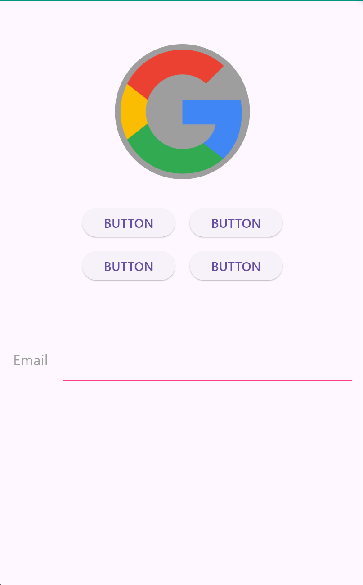
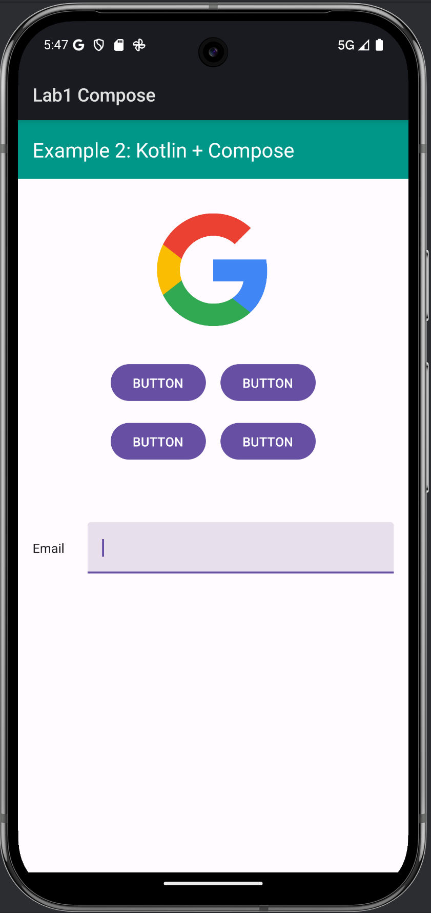
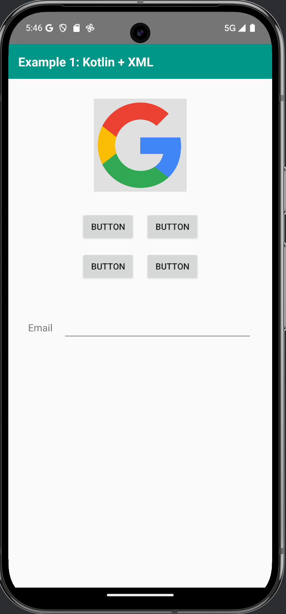
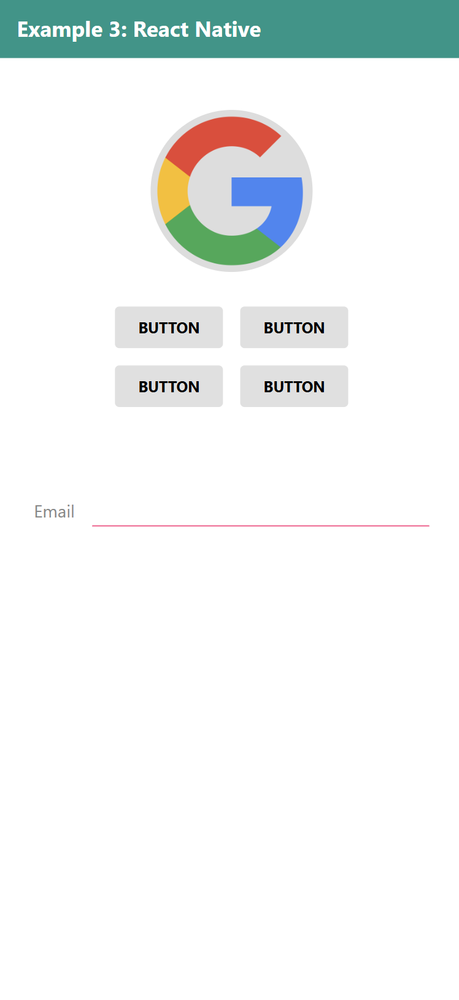
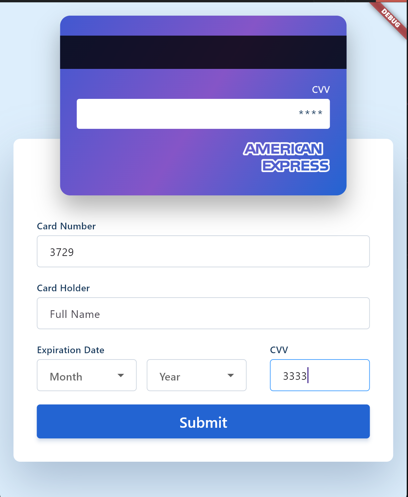
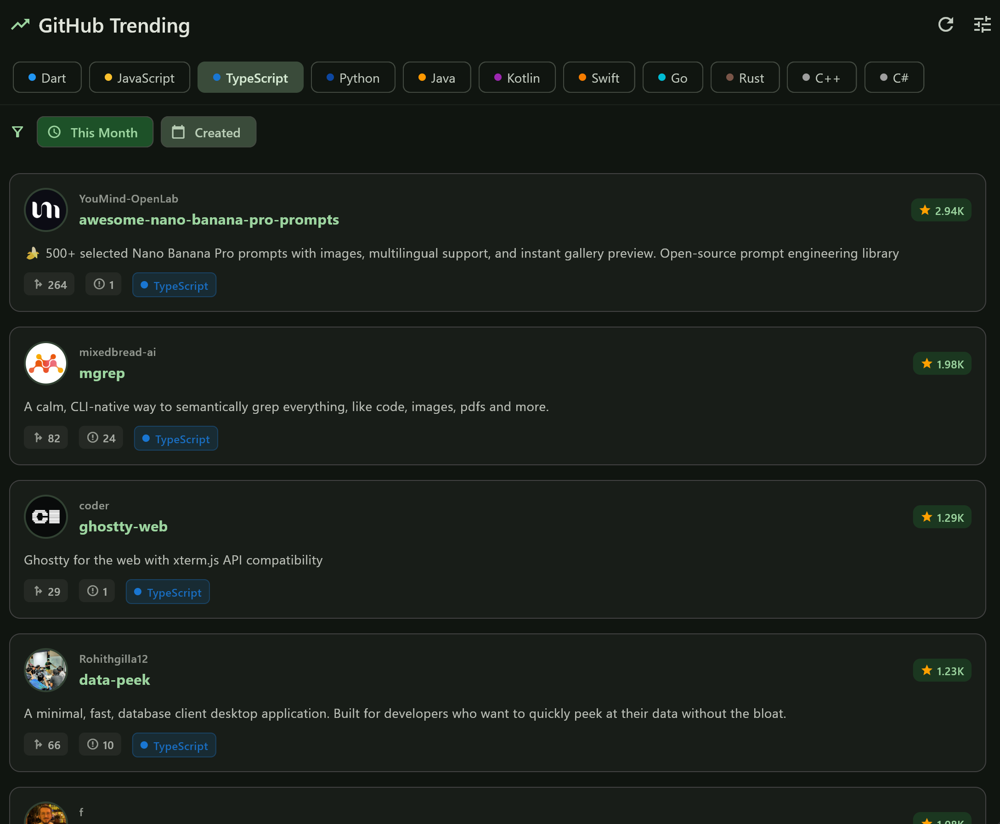
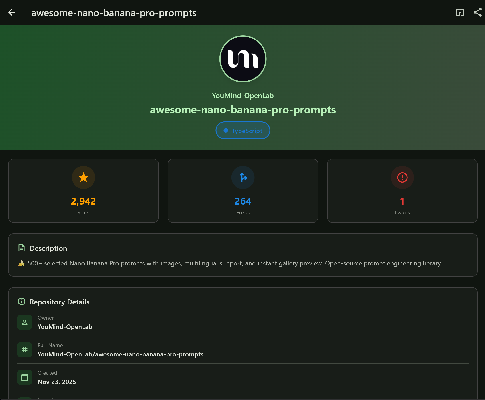

# TDDC73 - Interaction Programming

This repository contains all coursework for **TDDC73 Interaction Programming** at Linköping University.

---

## Repository Structure

### 📱 Lab 1: Multi-Framework UI Comparison

**Location:** `lab_1/`

Implementing the same UI across multiple mobile frameworks to compare development approaches.

| Flutter | Kotlin Compose | Kotlin XML | React Native |
|:-------:|:--------------:|:----------:|:------------:|
|  |  |  |  |

**Frameworks:**
- Flutter (`lab_1/flutter/`)
- Kotlin Compose (`lab_1/kotlin_compose/`)
- Kotlin XML (`lab_1/kotlin_xml/`)
- React Native (`lab_1/react_native/`)

**Documentation:** [lab_1/lab_1.md](lab_1/lab_1.md)

---

### 💳 Lab 2: Credit Card Form with Validation

**Location:** `lab_2/`

Interactive credit card form with real-time validation and visual feedback.

| Card Front | Card Back |
|:----------:|:---------:|
|  |  |

**Implementations:**
- Flutter app (`lab_2/lab2_flutter/`)
- Web version (`lab_2/executable-version/`)

**Features:**
- Real-time input validation
- Card type detection (Visa, MasterCard, American Express, etc.)
- Visual feedback with card flip animation
- Dynamic card preview with live updates
- Overlapping card and form design

**Documentation:** [lab_2/lab_2.md](lab_2/lab_2.md)

---

### 🌟 Lab 3: GitHub Trending App

**Location:** `lab_3/`

Application displaying trending GitHub repositories with filtering and search capabilities.

| Home Screen | Detail Screen |
|:-----------:|:-------------:|
|  |  |

**Implementation:**
- Flutter app (`lab_3/lab3_flutter/`)

**Features:**
- GitHub REST API integration
- Trending repository listing with sorting
- Time-based filtering (daily, weekly, monthly)
- Repository detail view with stats
- Material Design 3 UI

**Documentation:** [lab_3/lab_3.md](lab_3/lab_3.md)

---

### 🎨 Project: Primitive UI Library (Grade 5)

**Location:** `project/`

A custom Flutter GUI library built entirely from scratch using only primitive components.

**🌐 [Live Demo](https://tddc73.vercel.app/examples)**

**Project Structure:**
```
project/
├── primitive_ui/              # Flutter package (the library)
│   ├── lib/
│   │   ├── primitive_ui.dart
│   │   └── src/components/
│   └── test/                  # Widget tests
├── primitive_demo/            # Demo application
│   └── lib/main.dart
└── GETTING_STARTED_FLUTTER.md # Flutter tutorial for beginners
```

**Components Implemented:**

**UI Components:**
1. **PrimitiveCard** - Container with shadow, rounded corners, padding, and implicit animations
2. **PrimitiveToggleSwitch** - Animated on/off switch with smooth transitions
3. **PrimitiveSlider** - Range slider with implicit animations
4. **PrimitiveCircularProgress** - Indeterminate loading indicator
5. **PrimitiveButton** - Customizable button with variants (primary, secondary, destructive, outline, ghost, link)
6. **PrimitiveInput** - Text input with variants (outline, filled, flushed)

**Layout Components:**
7. **VStack** - Vertical stack layout with spacing and alignment
8. **HStack** - Horizontal stack layout with spacing and alignment
9. **ZStack** - Layered stack layout (z-ordering)

**Key Achievement:** All components built using ONLY:
- `CustomPaint` and `Canvas` for rendering
- `GestureDetector` for input
- Custom `RenderBox` for layout
- `AnimationController` for animations
- NO high-level widgets (Column, Row, Stack, Card, etc.)

**Quick Start:**
```bash
# Run the demo app
cd project/primitive_demo
flutter pub get
flutter run
```

**Documentation:**
- **API Documentation:** [project/primitive_ui/README.md](project/primitive_ui/README.md)
- **Demo Guide:** [project/primitive_demo/README.md](project/primitive_demo/README.md)
- **Documentation Site:** [docs-site/](docs-site/)

**Requirements:** [grade-5.md](grade-5.md)

---

## Course Information

**Course Code:** TDDC73  
**Course Name:** Interaction Programming  
**Institution:** Linköping University  
**Year:** 2025

### Course Objectives

- Understanding multi-platform UI development
- Learning different framework paradigms
- Mastering state management and event handling
- Building custom UI components from primitives
- API integration and data handling
- UI/UX design principles

---

## Technologies Used

### Frameworks
- **Flutter** (Dart) - Cross-platform UI toolkit
- **Kotlin Compose** - Modern Android UI
- **React Native** (TypeScript) - JavaScript-based cross-platform
- **Web Technologies** (HTML/CSS/JavaScript)
- **Next.js** - Documentation site framework

### Languages
- Dart
- Kotlin
- TypeScript/JavaScript
- HTML/CSS

### Tools
- Visual Studio Code
- Android Studio
- Flutter DevTools
- Vercel (deployment)
- Git

---

## Project Highlights

### Lab 1: Framework Comparison
- Implemented identical UI in 4 different frameworks
- Compared declarative vs imperative approaches
- Evaluated development experience and tooling
- Side-by-side visual comparison

### Lab 2: Form Validation
- Real-time input validation
- Card type detection with logo switching
- Card flip animation
- Overlapping layout design
- Cross-platform implementation (Flutter + Web)

### Lab 3: API Integration
- GitHub REST API consumption
- Trending repository rankings
- Time-based filtering (daily/weekly/monthly)
- Detail view with repository statistics
- Material Design 3 UI

### Project: Primitive UI
- **Deep dive into rendering fundamentals**
- 9 custom components (6 UI + 3 layout)
- Custom paint and canvas operations
- Manual layout calculation with RenderBox
- Gesture handling from primitives
- Implicit animations for smooth UX
- Comprehensive testing and documentation
- Live web demo deployment

---

## Running the Projects

### Flutter Projects

```bash
# Navigate to any Flutter project
cd lab_1/flutter
# or
cd lab_2/lab2_flutter
# or
cd lab_3/lab3_flutter
# or
cd project/primitive_demo

# Get dependencies
flutter pub get

# Run on connected device
flutter run

# Run tests (where applicable)
flutter test
```

### Web Projects

```bash
# Lab 2 web version
cd lab_2/executable-version
# Open html.html in a web browser

# Documentation site
cd docs-site
npm install
npm run dev
```

### Kotlin Projects

```bash
# Kotlin Compose or XML
cd lab_1/kotlin_compose  # or kotlin_xml

# Build and run with Gradle
./gradlew build
./gradlew run
```

---

## Documentation

- **[docs-site/](docs-site/)** - Nextra documentation site with API docs
- **[grade-5.md](grade-5.md)** - Grade 5 project requirements
- **[project.md](project.md)** - Alternative project specifications
- **[ui-test.md](ui-test.md)** - UI testing guidelines

---

## Repository Statistics

- **Labs:** 3
- **Project:** 1 (Grade 5)
- **Flutter Projects:** 5
- **Primitive UI Components:** 9
- **Test Cases:** 14+ widget tests
- **Live Demo:** [tddc73.vercel.app/examples](https://tddc73.vercel.app/examples)

---

## Key Learnings

### Multi-Framework Development
- Each framework has unique strengths and trade-offs
- Declarative UI (Flutter, Compose) vs Imperative UI (XML)
- Hot reload significantly improves development speed
- Type safety (TypeScript, Dart, Kotlin) prevents runtime errors

### State Management
- Local state with `setState()` for simple cases
- Lifting state up for shared state
- Callback patterns for child-to-parent communication
- Reactive programming principles

### Custom Component Development
- Understanding rendering pipelines with `CustomPaint`
- Manual layout calculations with `RenderBox`
- Custom paint operations with `Canvas` API
- Implicit animations for smooth UX
- Performance optimization techniques

### Testing and Quality
- Widget testing for UI verification
- Test-driven development practices
- Comprehensive API documentation
- Live demo deployment

---

## Academic Integrity

All code in this repository is original work created for the TDDC73 course. External resources and references are properly cited in individual project documentation.

---

## Contact

**Institution:** Linköping University  
**Course:** TDDC73 - Interaction Programming  
**Year:** 2025

---

## License

All projects in this repository are created for educational purposes as part of TDDC73 coursework.

---

## Quick Navigation

| Lab/Project | Description | Location | Demo |
|-------------|-------------|----------|------|
| **Lab 1** | Multi-framework UI | `lab_1/` | [Screenshots](#-lab-1-multi-framework-ui-comparison) |
| **Lab 2** | Credit card form | `lab_2/` | [Screenshots](#-lab-2-credit-card-form-with-validation) |
| **Lab 3** | GitHub trending | `lab_3/` | [Screenshots](#-lab-3-github-trending-app) |
| **Project** | Primitive UI library | `project/` | [Live Demo](https://tddc-73.vercel.app/demo) |

---

**Last Updated:** December 5, 2025
